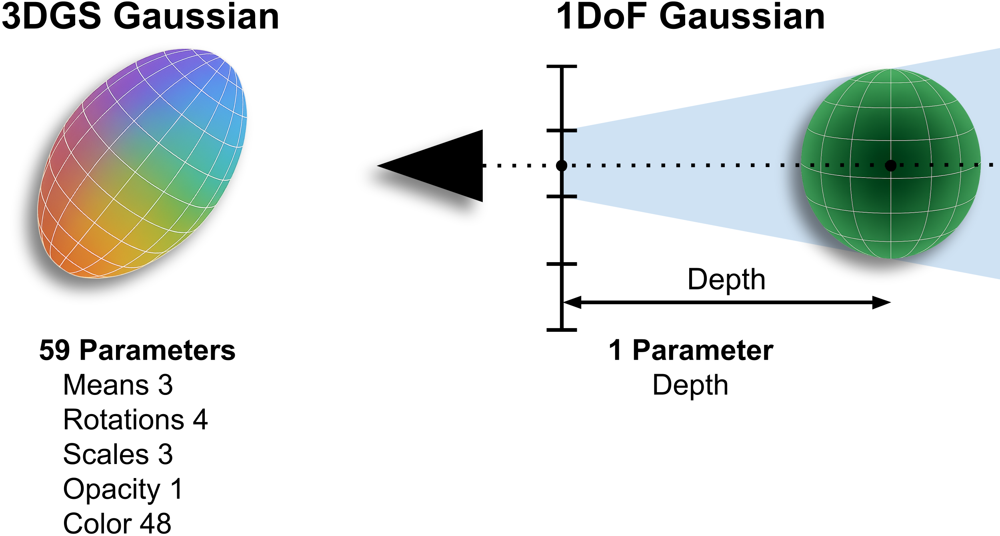

<div align="center">
<h1>PAGaS: Pixel-Aligned 1DoF Gaussian Splatting for Depth Refinement</h1>

<!-- <a href=""></a> -->
<a href="https://davidrecasens.github.io/pagas/"></a>

**[University of Zaragoza<sup>1</sup>](https://ropert.i3a.es/)**


[David Recasens<sup>1</sup>](https://davidrecasens.github.io/), [Robert Maier<sup></sup>](https://www.rmaier.net/), [Aljaz Bozic<sup></sup>](https://aljazbozic.github.io/), [Stephane Grabli<sup></sup>](https://www.linkedin.com/in/stephanegrabli/), [Javier Civera<sup>1</sup>](https://i3a.unizar.es/es/investigadores/javier-civera-sancho), [Tony Tung<sup></sup>](https://sites.google.com/site/tony2ng/), [Edmond Boyer<sup></sup>](https://morpheo.inrialpes.fr/people/Boyer/)
</div>

<p align="center">
  
</p>

### Table of Contents
- [⚙️ Setup](#setup)
- [📷 Run on custom data](#-run-on-custom-data)
- [📊 Evaluation](#-evaluation)

## ⚙️ Setup <a name="setup"></a>

Clone the repository, create a conda environment on Linux, and install the dependencies:
```bash
git clone https://.../pagas.git
cd pagas
conda env create --file environment.yml
conda activate pagas

# Install PyTorch that matches your CUDA (see with `nvcc -V`) from https://pytorch.org/get-started/ for example for CUDA 12.4:
pip3 install torch torchvision torchaudio --index-url https://download.pytorch.org/whl/cu124

pip install torchmetrics[image]
pip install --no-build-isolation --no-deps "fused_ssim @ git+https://github.com/rahul-goel/fused-ssim@328dc9836f513d00c4b5bc38fe30478b4435cbb5"  # Linux
pip install --no-build-isolation --no-deps "fused_ssim @ git+https://github.com/rahul-goel/fused-ssim"  # Windows
```

To use the **opacity-aware gsplat 3DGS rasterizer**:
```bash
cd thirdparty
git clone --recursive https://github.com/nerfstudio-project/gsplat.git
cd gsplat
git checkout bd64a47  # Originally built on top of this commit
git apply --reject --ignore-whitespace ../gsplat.patch
python -m pip install --no-build-isolation --no-deps .

# Go back to main repo and install in editable mode
cd ../../
python -m pip install -e .
```

With this patch, the gsplat 3DGS rasterizer supports these additional inputs:

- **radius_thres**: the pixel is only influenced by Gaussians whose projected centers fall within this maximum radius (in pixel units) around the pixel center. The distance from the pixel center to a corner is 0.71, which we recommend as a minimum. When context views are far from the target view, there can appear areas with low density of Gaussians, producing that some Gaussians that should be occluded may remain visible. In that case, use a larger threshold, for example 1.42 or higher, to block them.
- **depth_thres**: this depth is added to the depth of the first Gaussian that falls inside the pixel influence area defined by `radius_thres`. Only Gaussians that lie within both the `radius_thres` disk and this depth range contribute to the pixel rendering. Gaussians inside the radius but further than this depth range are ignored. The pixel alpha is computed using only Gaussians in this valid range. `depth_thres` is given in the scene scale units.
- **opacities**: can be view dependent (new, shape `#views x #gauss`) or view independent (classic, shape `#gauss`).

To visualize the PAGaS optimization with the rerun viewer:
```
conda install -c conda-forge rerun-sdk
```


## 📷 Run on custom data

This section explains how to run the full or partial 3D reconstruction pipeline with PAGaS on your own scan:

`images` → `camera intrinsics and extrinsics` → `optional mask` → `initial baseline mesh` → `mesh to depth` → `refined depth by PAGaS` → `refined depth to mesh`

Each scan must follow this directory structure:
```text
scan/
|-- images/      # [.png/.jpg/.jpeg]  (e.g. 0000.png, 0001.png, ...)
|-- depth_init/  # [.npz] initial depth to refine
|-- masks/       # [.png/.jpg/.jpeg]  optional binary masks       
|-- sparse/      # camera intrinsics and extrinsics in COLMAP format
    |-- 0/
        |-- cameras.txt/.bin
        |-- images.txt/.bin 
        |-- points3D.txt/.bin  # not needed for PAGaS, only for 2DGS and PGSR
```

The easiest to run the full pipeline is using the **automatic reconstruction** script, run on the scan folder that contains the `images` folder.
If you do not want to use MVSAnywhere, 2DGS, or PGSR to estimate the initial mesh, you can provide your own initial mesh or depth maps. Save them in the scan folder as `mesh_init.ply` or inside the `depth_init` folder. The automatic pipeline detects these inputs and continues from there.
You can also save inconsistent depths in the `depth` folder and they will be fused into `mesh_init.ply`. 
If you already have camera calibration in the `sparse` folder or masks in the `masks` folder, the script reuses them. 
If the script is interrupted while refining depths, it resumes from the last processed view.

```bash
scripts/run_automatic.sh --data_folder /absolut/path/to/scan
```

<table>
  <thead>
    <tr>
      <th width="220">Optional argument</th>
      <th>Description</th>
    </tr>
  </thead>
  <tbody>
    <tr>
      <td><code>--path_mvs_method</code></td>
      <td>Path to your installed initial MVS method (PGSR, 2DGS, or MVSAnywhere). The selected method is used to estimate the initial mesh <code>mesh_init.ply</code>.</td>
    </tr>
    <tr>
      <td><code>--get_masks</code></td>
      <td>Disabled by default. If set, estimates foreground masks in object centric scenes to ignore background pixels during PAGaS refinement. Skipped when a <code>masks</code> folder already exists.</td>
    </tr>
    <tr>
      <td><code>--mesh_res</code></td>
      <td>Default value is <code>4000</code>. Mesh resolution used to define the voxel size for TSDF fusion when fusing baseline depth maps into <code>mesh_init.ply</code> and when fusing refined PAGaS depths. If TSDF fusion runs out of RAM, reduce this value. The automatic pipeline detects existing depth maps and continues from them. You can override voxel size and depth truncation with <code>--voxel_size</code> and <code>--depth_trunc</code>.</td>
    </tr>
    <tr>
      <td><code>--no_undist</code></td>
      <td>By default, if initial <code>depth</code>, <code>mesh_init.ply</code>, <code>depth_init</code>, or <code>sparse</code> are missing, COLMAP undistorts the images and masks into an <code>undist</code> folder and the pipeline runs there. Phone lenses often introduce strong distortion, so undistortion is recommended. When only images and/or masks are given, the <code>--no_undist</code> flag tells COLMAP to estimate a pinhole camera model directly.</td>
    </tr>
    <tr>
      <td><code>--no_shared_intrinsics</code></td>
      <td>By default, if camera calibration is not given in <code>sparse</code>, COLMAP estimates a shared intrinsic camera for all images. <code>--no_shared_intrinsics</code> tells COLMAP to estimate individual intrinsics. This is strongly discouraged when all images were recorded with the same device, because COLMAP self calibration is less stable without this constraint.</td>
    </tr>
    <tr>
      <td><code>--exposure</code></td>
      <td>Optimizes a per-image exposure compensation model during refinement. Useful when images have significant exposure differences.</td>
    </tr>
    <tr>
      <td><code>--consistent</code></td>
      <td>Optionally runs stereo depth consistency filtering on the refined depths.</td>
    </tr>
    <tr>
      <td><code>--save_extra</code></td>
      <td>Saves refined normals in <code>.npz</code> format and colorized <code>.png</code> depth and normal maps. This adds some overhead.</td>
    </tr>
  </tbody>
</table>


<details>
<summary><span><b>Advanced use</b> for full control of each step in the pipeline</span></summary>

The minimum input is a folder `images` inside your scene folder. 

If your input is a video `video.mp4`, extract all frames as images:
```bash
cd /path/to/scan
mkdir -p images
ffmpeg -i video.mp4 -vsync 0 -start_number 0 images/%06d.png  # use -vf fps=8 to sample at 8 fps
```

If you only want to reconstruct a foreground object, extract binary masks. For example, using [rembg](https://github.com/danielgatis/rembg):
```bash
rembg p -m birefnet-massive -om images masks    # extract matting masks
mogrify -colorspace Gray -threshold 50% masks/* # threshold matting to get binary masks
```

Next, obtain camera intrinsics and extrinsics in COLMAP format. You can estimate them with the provided COLMAP script:
```bash
cd /path/to/pagas
scripts/run_colmap.sh /path/to/scan
```

<details>
<summary><span>Optional arguments for <code>run_colmap.sh</code></span></summary>


<table>
  <thead>
    <tr>
      <th width="200">Optional argument</th>
      <th>Description</th>
    </tr>
  </thead>
  <tbody>
    <tr>
      <td><code>--shared_intrinsics</code></td>
      <td>Forces COLMAP to use a single shared camera for all images when intrinsics are unknown. This helps stabilize self calibration in datasets recorded with the same device.</td>
    </tr>
    <tr>
      <td><code>--intrinsics</code></td>
      <td>Relative path inside the scene to a <code>cameras.txt</code> file, or a folder that contains it. If provided, the script fixes intrinsics to that model instead of using self calibration.</td>
    </tr>
    <tr>
      <td><code>--undistort_images</code></td>
      <td>Indicates that input images are distorted. SfM then uses the OPENCV model. The script also exports an undistorted copy of the sparse model (as PINHOLE) into <code>&lt;scene&gt;/undist/</code>.</td>
    </tr>
    <tr>
      <td><code>--mvs</code></td>
      <td>Runs COLMAP multi-view stereo (PatchMatch, StereoFusion, meshing) with high quality, CPU based, full resolution settings. Always undistorts to <code>&lt;scene&gt;/mvs/</code>.</td>
    </tr>
  </tbody>
</table>


</details>

Then estimate the initial mesh with any method. We show three options: one learning-based multi-view stereo method (MVSAnywhere, uses local views, faster) and two Gaussian Splatting methods (2DGS and PGSR, use all views, global consistent). We recommend PGSR.

1) **MVSAnywhere**. Install [MVSAnywhere](https://github.com/nianticlabs/mvsanywhere/tree/main) in a conda environment and estimate depth at resolution 480x640. PAGaS automatically upsamples the depth to the input image resolution:
```bash
conda activate mvsanywhere  

# Estimate depth
./experiments/MVSAnywhere_depth_predictor.sh /path/to/mvsanywhere /path/to/data_folder "scan"

# Fuse depth with our script (or use the original MVSAnywhere mesh)
./experiments/fuse_depth.sh --data_folder="/path/to/scan" --depth_name="depth_mvsanywhere" --mesh_name="mesh_init.ply"
```

2) **2DGS**. Install [2DGS](https://github.com/hbb1/2d-gaussian-splatting):
```bash
conda activate 2dgs
cd /path/to/2dgs

# Train and render
python train.py -s /path/to/scan -m /path/to/scan/2dgs_results -r 2 --depth_ratio 1
python render.py -s /path/to/scan -m /path/to/scan/2dgs_results -r 2 --depth_ratio 1 --skip_test --skip_train

# Move mesh to main folder
mv /path/to/scan/2dgs_results/train/ours_30000/fuse_post.ply /path/to/scan/mesh_init.ply
```

3) **PGSR**. Install [PGSR](https://github.com/zju3dv/PGSR):
```bash
conda activate pgsr
cd /path/to/PGSR

# Train and render
python train.py -s /path/to/scan -m /path/to/scan/pgsr_results --max_abs_split_points 0 --opacity_cull_threshold 0.05
python render.py -m /path/to/scan/pgsr_results --max_depth 10.0 --voxel_size 0.01 -r 2 

# Move mesh to main folder
mv /path/to/scan/pgsr_results/mesh/tsdf_fusion_post.ply /path/to/scan/mesh_init.ply
```

Fourth, extract `depth_init` from `mesh_init.ply`:
```bash
conda activate pagas
cd /path/to/pagas
scripts/mesh_to_depth.sh /path/to/scan
```

Fifth, refine depth with PAGaS:
```bash
scripts/run_pagas.sh --data_dir="/path/to/scan"
```

<details>
<summary><span>Optional arguments for <code>run_pagas.sh</code></span></summary>

<table>
  <thead>
    <tr>
      <th width="220">Optional argument</th>
      <th>Description</th>
    </tr>
  </thead>
  <tbody>
    <tr>
      <td><code>--masks_name</code></td>
      <td>Name of the folder that contains the <code>.png</code> binary masks that define valid pixels to refine.</td>
    </tr>
    <tr>
      <td><code>--depth_folder</code></td>
      <td>Name of the folder that contains the depth to refine. Default is <code>depth_init</code>. It contains individual depth maps in <code>.npz</code> format. The input depth can have lower resolution than the images; it is automatically upsampled to match the image resolution. The refined depth has the same resolution as the images, except for a small crop if needed to ensure clean divisions by 2.</td>
    </tr>
    <tr>
      <td><code>--scale_factors</code></td>
      <td>Space separated list of scales to optimize. Use powers of two, for example <code>"16 8 4 2 1"</code>, <code>"1"</code>, or <code>"4 2"</code>. Optimization starts from the largest scale (lowest resolution) and progresses to the finest scale (highest resolution). <code>"2 1"</code> works well in our tests. Use more scales when <code>depth_init</code> is very coarse.</td>
    </tr>
    <tr>
      <td><code>--max_steps</code></td>
      <td>Maximum number of optimization steps per scale. We observe convergence with values around <code>200</code> or <code>100</code> at scale 2 and <code>100</code> or <code>50</code> at scale 1. If you provide a single number, it is used for all scales.</td>
    </tr>
    <tr>
      <td><code>--lr</code></td>
      <td>Learning rate per scale. For coarser scales, use higher values when <code>depth_init</code> is far from the true depth, for example <code>1e-4 1e-5</code> for scales 2 and 1. If you provide a single number, it is used for all scales.</td>
    </tr>
    <tr>
      <td><code>--radius_thres</code></td>
      <td>Radius thresholds (in pixels) at the start and end of each scale. Provide them as a list of pairs, for example <code>1.7 1.42 2. 1.42</code> for scales 2 and 1, meaning [(1.7, 1.42), (2., 1.42)]. Within each scale, the radius changes linearly from the first to the second value. Values between <code>1.42</code> and <code>2.</code> work well. Using <code>1.42 1.42</code> or <code>2. 2.</code> is often enough. If you provide a single pair, it is applied to all scales.</td>
    </tr>
    <tr>
      <td><code>--depth_slices</code></td>
      <td>Number of slices that the depth range (automatically determined using the camera poses) is divided into to compute the depth threshold at the start and end of each scale. It varies linearly with the steps inside each scale, similar to <code>--radius_thres</code>. Values like <code>100 100</code> work well for most scenes. Higher values such as <code>1000 1000</code> are useful for large scenes such as Tanks and Temples. Larger scenes and thinner structures benefit from higher values. Alternatively, <code>--depth_thres</code> can be used to set the depth threshold directly in the depth units of <code>depth_init</code>. If you provide a single pair, it is applied to all scales.</td>
    </tr>
    <tr>
      <td><code>--normal_reg</code></td>
      <td>Strength of the normals from depth smoothness regularization per scale. Default is <code>0.0</code>, which works well in most cases. You can experiment with values in <code>[0., 0.01]</code>.</td>
    </tr>
    <tr>
      <td><code>--num_context_views</code></td>
      <td>Number of context views to use. Default is <code>10</code>. <code>-1</code> uses all views listed in <code>views.cfg</code>.</td>
    </tr>
    <tr>
      <td><code>--viewer</code></td>
      <td>Enables visualization of the optimization for the first view.</td>
    </tr>
    <tr>
      <td><code>--starting_view</code></td>
      <td>Index of the first view to refine. Useful to resume refinement by skipping already processed frames.</td>
    </tr>
    <tr>
      <td><code>--save_extra</code></td>
      <td>Saves refined normals from depth in <code>.npz</code> format and colorized <code>.png</code> depth and normal maps. This adds some overhead.</td>
    </tr>
    <tr>
      <td><code>--exposure</code></td>
      <td>Optimizes a per image exposure compensation model during refinement. Useful when images have significant exposure differences.</td>
    </tr>
  </tbody>
</table>


</details>

Optionally, run stereo depth consistency filtering. Filtered depth maps are saved in the `depth_consistent` folder:
```bash
python scripts/consistent_depth.py --data_folder="/path/to/scan"
```                                                               

Finally, fuse refined depth into a mesh:
```bash
scripts/fuse_depth.sh --data_folder=/path/to/scan/results/depth_init_pagas --depth_name=depth/depth_consistent
```

<details>
<summary><span>Optional arguments for <code>fuse_depth.sh</code></span></summary>

<table>
  <thead>
    <tr>
      <th width="250">Optional argument</th>
      <th>Description</th>
    </tr>
  </thead>
  <tbody>
    <tr>
      <td><code>--mesh_res</code></td>
      <td>Mesh resolution used to compute voxel size when <code>--voxel_size</code> is <code>-1</code>.</td>
    </tr>
    <tr>
      <td><code>--voxel_size</code></td>
      <td>Voxel size in pose units. Use <code>-1</code> to compute it automatically.</td>
    </tr>
    <tr>
      <td><code>--depth_name</code></td>
      <td>Name of the depth folder. Default is <code>"depth"</code>.</td>
    </tr>
    <tr>
      <td><code>--mask_name</code></td>
      <td>Optional mask folder. Leave empty <code>""</code> if masks are already applied (pixel's depth is 0).</td>
    </tr>
    <tr>
      <td><code>--relative_path_to_colmap</code></td>
      <td>Relative path to the COLMAP <code>sparse/0</code> folder. Default <code>""</code> assumes sparse folder is in the same main folder as the images.</td>
    </tr>
    <tr>
      <td><code>--depth_trunc</code></td>
      <td>Maximum depth in pose units. Use <code>-1</code> if unknown.</td>
    </tr>
    <tr>
      <td><code>--sdf_trunc</code></td>
      <td>TSDF truncation distance, typically a few times the voxel size.</td>
    </tr>
    <tr>
      <td><code>--min_mesh_size</code></td>
      <td>Minimum triangle count for keeping a mesh component.</td>
    </tr>
    <tr>
      <td><code>--num_cluster</code></td>
      <td>Number of mesh clusters to retain.</td>
    </tr>
    <tr>
      <td><code>--erode_borders</code></td>
      <td>Erodes depth borders before fusion.</td>
    </tr>
  </tbody>
</table>


</details>

</details>

## 📊 Evaluation

### DTU and Tanks and Temples datasets

Download the [DTU dataset prepared by 2DGS](https://drive.google.com/file/d/1ODiOu72tAGPTnhVn0cFZ9MvymDgcoHxQ/view?usp=drive_link). Since their mask folders are named `mask` instead of `masks`, and they are not cropped consistently with the images and intrinsics, run:
```bash
python scripts/crop_dtu_2dgs_masks.py --data_folder /path/to/DTU
```

To avoid confusion, we rename the uncropped masks from `mask` to `masks_uncropped`. The 2DGS authors provide COLMAP camera calibration on top of the DTU images and cropped them slightly. We use these cropped images. We evaluate as in 2DGS, culling the meshes during evaluation using the uncropped masks and `cameras.npz`.

For Tanks and Temples (TnT), follow the 2DGS instructions to obtain the dataset. Download the [preprocessed TNT data by GOF](https://huggingface.co/datasets/ZehaoYu/gaussian-opacity-fields/tree/main) and the ground truth point clouds, alignments, and crop files from the original [TnT website](https://www.tanksandtemples.org/download/). Combine these resources as described in 2DGS.

### Refine baseline meshes with PAGaS and evaluate

First, run 2DGS, PGSR, and MVSAnywhere and save their meshes as `mesh_2dgs.ply`, `mesh_pgsr.ply`, and `mesh_mvsa.ply` in each scene folder. We fuse the baseline depths into the initial meshes using our fusion script `scripts/fuse_depth.sh`. For TnT evaluation, you need a separated conda environment with `open3d==0.10.0`. For example, reuse the 2DGS environment and install it there:

```bash
pip install open3d==0.10.0
```

Then run the PAGaS refinement and evaluation, giving the conda environment name with `--conda_env_tnt`:
```bash
./eval.sh --path_DTU=/path/to/DTU --path_DTU_gt=/path/to/MVSData --path_TNT=/path/to/TNT --conda_env_tnt=2dgs
```

## Acknowledgements
Our Occlusion-Aware 3DGS Rasterizer is built on top of [Gsplat](https://github.com/nerfstudio-project/gsplat).
Evaluation scripts for DTU and TnT dataset are based on [DTUeval-python](https://github.com/jzhangbs/DTUeval-python) and [TanksAndTemples](https://github.com/isl-org/TanksAndTemples/tree/master/python_toolbox/evaluation) respectively. We thank all the authors for their great work. 

## Citation
```bibtex
soon...
```